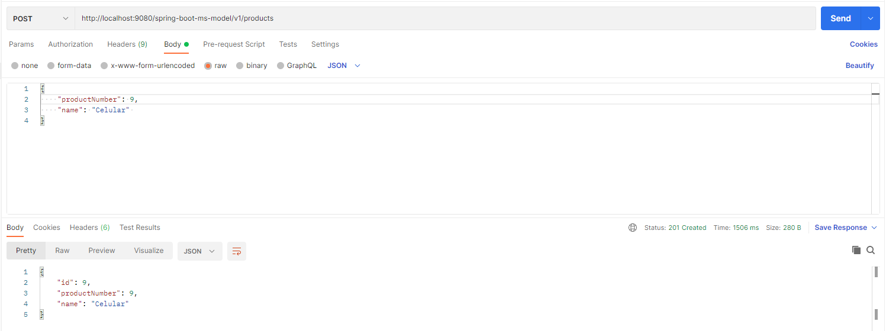
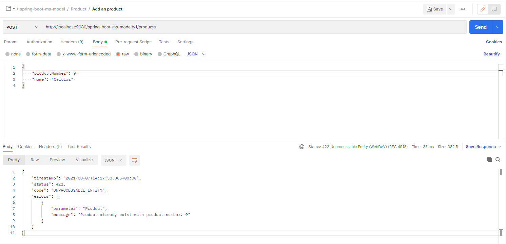
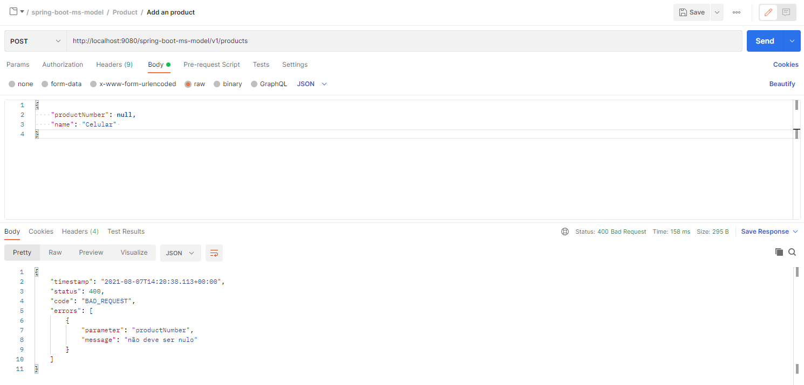
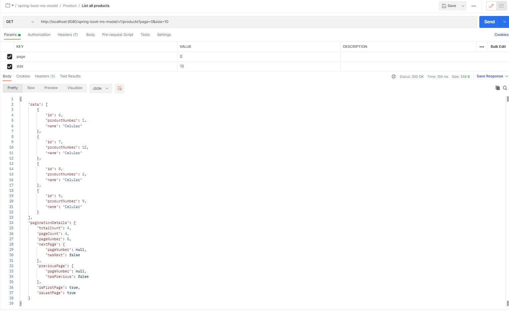
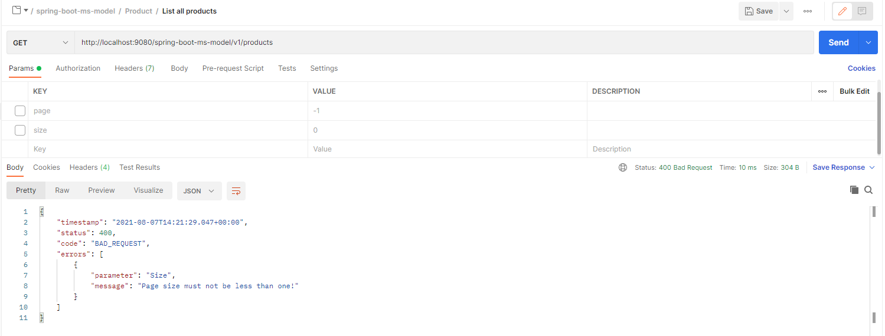
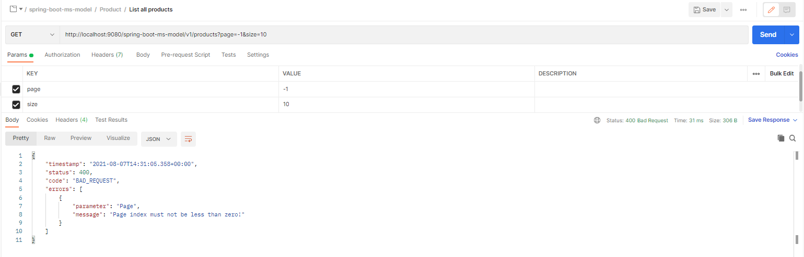

# spring-boot-ms-model

---

```
POST - http://localhost:9080/spring-boot-ms-model/v1/products
```

- add new product


- add existing product


- add product with invalid request


---
---

```
GET - http://localhost:9080/spring-boot-ms-model/v1/products?page=0&size=10
```
- get list of product with valid request


- get list of product with invalid request page

 
- get list of product with invalid request size
